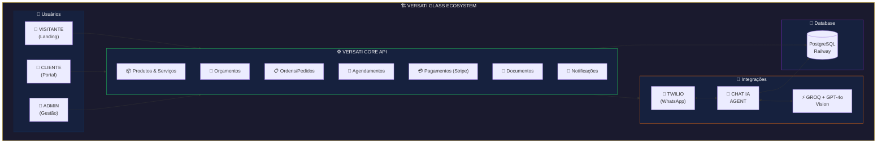
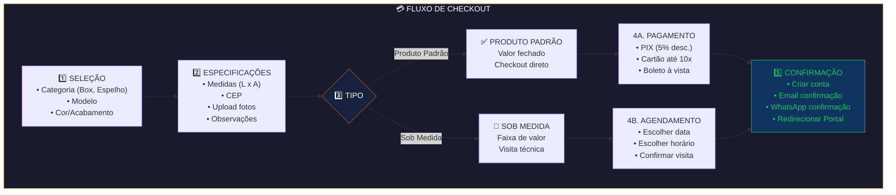
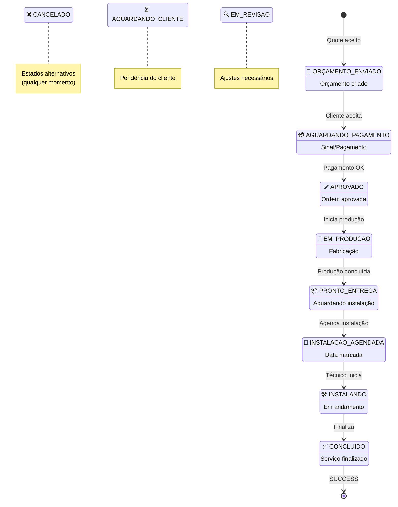
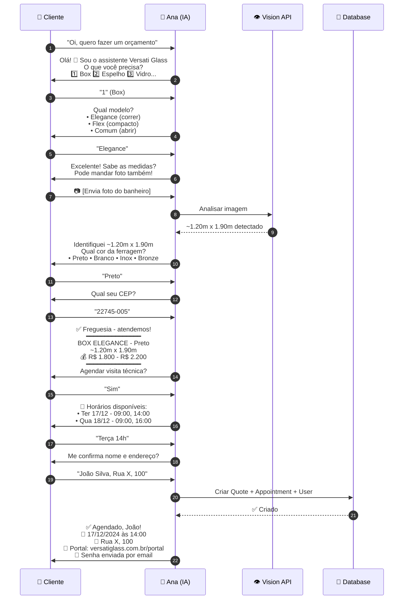
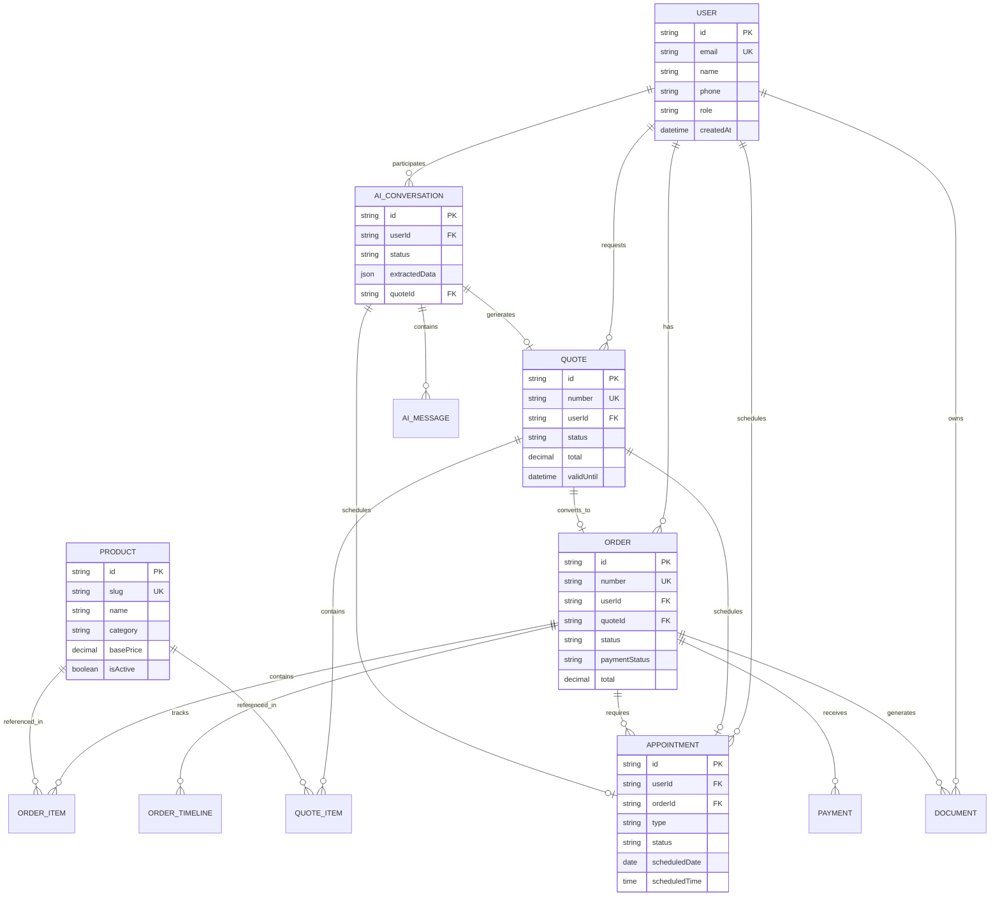
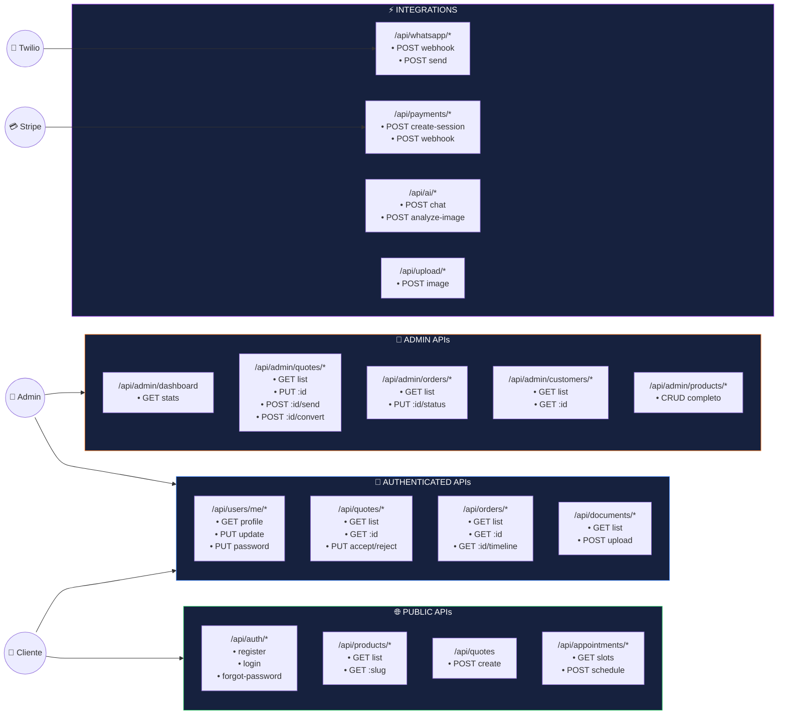
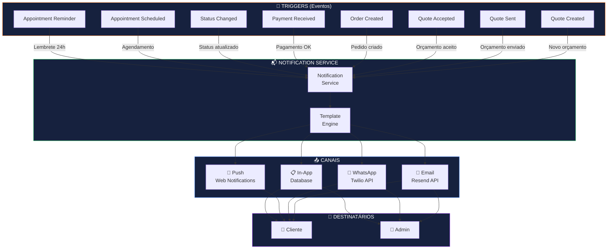

# 📋 VERSATI GLASS - PRODUCT REQUIREMENTS DOCUMENT (PRD)

## VISÃO GERAL

**Produto:** Versati Glass - Plataforma Digital Integrada
**Versão:** 2.0.0
**Data:** 18 Dezembro 2024
**Tipo:** Web Application (Next.js) + AI Chat Assistant (Groq + OpenAI)
**Objetivo:** Ecossistema digital completo para vidraçaria premium que conecta clientes, atendimento automatizado por IA e gestão em tempo real
**Atualização:** Diagramas convertidos para Mermaid

### URLs Planejadas

- **Frontend:** https://www.versatiglass.com.br (Vercel)
- **Backend API:** https://api.versatiglass.com.br (Railway)
- **WhatsApp:** +55 (21) 98253-6229 (Twilio)

---

## 1. ARQUITETURA DO ECOSSISTEMA



---

## 2. MÓDULOS DO SISTEMA

### 2.1 MÓDULO LANDING PAGE (Público)

#### Funcionalidades

| Feature        | Descrição                          | Prioridade | Status |
| -------------- | ---------------------------------- | ---------- | ------ |
| Home Hero      | Seção impactante com CTA principal | P0         | ⬜     |
| Sobre          | História e diferenciais da empresa | P1         | ⬜     |
| Produtos       | Catálogo visual de produtos        | P0         | ⬜     |
| Serviços       | Lista de serviços oferecidos       | P0         | ⬜     |
| Portfólio      | Galeria de projetos realizados     | P1         | ⬜     |
| Depoimentos    | Avaliações de clientes             | P2         | ⬜     |
| Orçamento      | Formulário de solicitação          | P0         | ⬜     |
| Contato        | Informações e formulário           | P0         | ⬜     |
| WhatsApp Float | Botão flutuante WhatsApp           | P0         | ⬜     |
| SEO            | Meta tags, sitemap, schema         | P1         | ⬜     |

#### Páginas

| Página            | Rota                           | Descrição           |
| ----------------- | ------------------------------ | ------------------- |
| Home              | `/`                            | Landing principal   |
| Produtos          | `/produtos`                    | Catálogo geral      |
| Produto Categoria | `/produtos/[categoria]`        | Box, Espelhos, etc. |
| Produto Detalhe   | `/produtos/[categoria]/[slug]` | Detalhe do produto  |
| Serviços          | `/servicos`                    | Lista de serviços   |
| Portfólio         | `/portfolio`                   | Galeria de projetos |
| Projeto Detalhe   | `/portfolio/[slug]`            | Detalhe do projeto  |
| Orçamento         | `/orcamento`                   | Formulário/Checkout |
| Contato           | `/contato`                     | Página de contato   |
| Sobre             | `/sobre`                       | Sobre a empresa     |

---

### 2.2 MÓDULO CHECKOUT/ORÇAMENTO (Público)

#### Funcionalidades

| Feature             | Descrição                             | Prioridade | Status |
| ------------------- | ------------------------------------- | ---------- | ------ |
| Seleção de Produtos | Escolher produtos do catálogo         | P0         | ⬜     |
| Especificações      | Formulário de medidas e detalhes      | P0         | ⬜     |
| Upload de Imagens   | Enviar fotos do local                 | P1         | ⬜     |
| Cálculo Automático  | Estimativa de valor (produtos padrão) | P0         | ⬜     |
| Agendamento         | Marcar visita técnica (sob medida)    | P0         | ⬜     |
| Pagamento Online    | Stripe (PIX, Cartão)                  | P0         | ⬜     |
| Criação de Conta    | Auto-cadastro após compra             | P0         | ⬜     |
| Confirmação         | Email + WhatsApp de confirmação       | P0         | ⬜     |

#### Fluxo de Checkout



---

### 2.3 MÓDULO PORTAL DO CLIENTE (Autenticado)

#### Funcionalidades

| Feature          | Descrição                      | Prioridade | Status |
| ---------------- | ------------------------------ | ---------- | ------ |
| Dashboard        | Visão geral do cliente         | P0         | ⬜     |
| Minhas Ordens    | Lista de pedidos/serviços      | P0         | ⬜     |
| Detalhe da Ordem | Timeline de status             | P0         | ⬜     |
| Orçamentos       | Orçamentos pendentes/aprovados | P0         | ⬜     |
| Documentos       | Contratos, garantias, NFs      | P1         | ⬜     |
| Agendamentos     | Próximas visitas/instalações   | P0         | ⬜     |
| Pagamentos       | Histórico e pendências         | P1         | ⬜     |
| Perfil           | Dados pessoais e endereços     | P1         | ⬜     |
| Chat/Suporte     | Comunicação com a empresa      | P2         | ⬜     |
| Avaliações       | Avaliar serviços concluídos    | P2         | ⬜     |

#### Páginas do Portal

| Página            | Rota                      | Descrição            |
| ----------------- | ------------------------- | -------------------- |
| Dashboard         | `/portal`                 | Visão geral          |
| Ordens            | `/portal/ordens`          | Lista de ordens      |
| Ordem Detalhe     | `/portal/ordens/[id]`     | Detalhe com timeline |
| Orçamentos        | `/portal/orcamentos`      | Lista de orçamentos  |
| Orçamento Detalhe | `/portal/orcamentos/[id]` | Detalhe do orçamento |
| Agenda            | `/portal/agenda`          | Próximas visitas     |
| Documentos        | `/portal/documentos`      | Arquivos             |
| Pagamentos        | `/portal/pagamentos`      | Histórico financeiro |
| Perfil            | `/portal/perfil`          | Dados do cliente     |

#### Status de Ordem (Timeline)



---

### 2.4 MÓDULO CHAT IA ASSISTIDO (Web + WhatsApp) 🆕

**Status**: ✅ Implementado (v1.1.0)
**Stack**: Groq (Llama 3.3-70b) + OpenAI (GPT-4o Vision)
**Canais**: Chat Web (modal) + WhatsApp Business (planejado)

#### Funcionalidades Implementadas

| Feature                          | Descrição                                                 | Prioridade | Status |
| -------------------------------- | --------------------------------------------------------- | ---------- | ------ |
| **Chat Web Modal**               | Interface conversacional integrada na página de orçamento | P0         | ✅     |
| **Atendimento Contextual**       | Saudação e identificação de necessidade com contexto      | P0         | ✅     |
| **Análise de Linguagem Natural** | Entende "preciso de um box" via Groq Llama 3.3            | P0         | ✅     |
| **Upload de Imagens**            | Cliente envia foto do local para análise                  | P0         | ✅     |
| **GPT-4o Vision**                | Analisa foto, identifica produto e estima medidas         | P0         | ✅     |
| **Extração de Dados**            | Captura nome, telefone, medidas da conversa               | P0         | ✅     |
| **Histórico de Conversa**        | Mantém contexto da sessão (AiConversation)                | P0         | ✅     |
| **Geração de Orçamento**         | Converte conversa em Quote estruturado                    | P0         | ⏳     |
| **Personalidade "Ana"**          | Assistente virtual amigável e profissional                | P0         | ✅     |
| **Fallback Inteligente**         | Respostas pré-programadas se IA falhar                    | P1         | ✅     |
| **Escalada Humana**              | Detecta quando transferir para atendente                  | P1         | ✅     |
| **WhatsApp Integration**         | Bot 24/7 via Twilio (webhook implementado)                | P1         | ⏳     |
| **Agendamento**                  | Marcar visita técnica via chat                            | P1         | 🔜     |
| **Status de Ordem**              | Consultar andamento pelo chat                             | P2         | 🔜     |

#### Fluxo de Conversação



---

### 2.5 MÓDULO ADMIN (Gestão Interna)

#### Funcionalidades

| Feature       | Descrição                         | Prioridade | Status |
| ------------- | --------------------------------- | ---------- | ------ |
| Dashboard     | Métricas e KPIs                   | P0         | ⬜     |
| Produtos      | CRUD de produtos                  | P0         | ⬜     |
| Serviços      | CRUD de serviços                  | P0         | ⬜     |
| Orçamentos    | Gestão de orçamentos              | P0         | ⬜     |
| Ordens        | Gestão de pedidos/serviços        | P0         | ⬜     |
| Clientes      | CRM básico                        | P1         | ⬜     |
| Agenda        | Calendário de visitas/instalações | P0         | ⬜     |
| Financeiro    | Pagamentos e relatórios           | P1         | ⬜     |
| Portfólio     | Gestão de projetos/fotos          | P1         | ⬜     |
| Configurações | Parâmetros do sistema             | P2         | ⬜     |
| Usuários      | Gestão de funcionários            | P2         | ⬜     |

#### Páginas Admin

| Página          | Rota                   | Descrição           |
| --------------- | ---------------------- | ------------------- |
| Dashboard       | `/admin`               | Visão geral         |
| Produtos        | `/admin/produtos`      | Lista de produtos   |
| Produto Editar  | `/admin/produtos/[id]` | Edição de produto   |
| Serviços        | `/admin/servicos`      | Lista de serviços   |
| Orçamentos      | `/admin/orcamentos`    | Lista de orçamentos |
| Ordens          | `/admin/ordens`        | Lista de ordens     |
| Ordem Detalhe   | `/admin/ordens/[id]`   | Detalhe da ordem    |
| Clientes        | `/admin/clientes`      | Lista de clientes   |
| Cliente Detalhe | `/admin/clientes/[id]` | Perfil do cliente   |
| Agenda          | `/admin/agenda`        | Calendário          |
| Financeiro      | `/admin/financeiro`    | Relatórios          |
| Portfólio       | `/admin/portfolio`     | Gestão de projetos  |
| Config          | `/admin/config`        | Configurações       |

---

## 3. MODELOS DE DADOS

### 3.0 Diagrama de Entidades (ER Simplificado)



### 3.1 User (Usuário)

```typescript
User = {
  id: string (UUID),
  email: string (unique),
  password: string (hashed),
  name: string,
  phone: string,
  cpfCnpj: string?,

  // Endereço principal
  address: {
    street: string,
    number: string,
    complement: string?,
    neighborhood: string,
    city: string,
    state: string,
    zipCode: string,
  },

  // Auth
  role: enum ('customer', 'admin', 'staff'),
  emailVerified: boolean,
  phoneVerified: boolean,
  authProvider: enum ('email', 'google'),
  googleId: string?,

  // Timestamps
  createdAt: datetime,
  updatedAt: datetime,
  lastLoginAt: datetime?,

  // Relações
  orders: Order[],
  quotes: Quote[],
  appointments: Appointment[],
  documents: Document[],
}
```

### 3.2 Product (Produto)

```typescript
Product = {
  id: string (UUID),

  // Básico
  name: string,
  slug: string (unique),
  description: string,
  shortDescription: string,

  // Categorização
  category: enum ('box', 'espelhos', 'vidros', 'portas_janelas', 'fechamentos', 'outros'),
  subcategory: string?,

  // Mídia
  images: string[] (URLs),
  thumbnail: string (URL),

  // Preço
  priceType: enum ('fixed', 'per_m2', 'quote_only'),
  basePrice: decimal?,
  pricePerM2: decimal?,
  priceRange: {
    min: decimal,
    max: decimal,
  }?,

  // Opções
  colors: string[] ('preto', 'branco', 'inox', 'bronze'),
  finishes: string[]?,
  thicknesses: string[]?,

  // Status
  isActive: boolean,
  isFeatured: boolean,

  // SEO
  metaTitle: string?,
  metaDescription: string?,

  // Timestamps
  createdAt: datetime,
  updatedAt: datetime,
}
```

### 3.3 Quote (Orçamento)

```typescript
Quote = {
  id: string (UUID),
  number: string (unique, ex: "ORC-2024-001"),

  // Cliente
  userId: string (FK User),
  customerName: string,
  customerEmail: string,
  customerPhone: string,

  // Endereço do serviço
  serviceAddress: {
    street: string,
    number: string,
    complement: string?,
    neighborhood: string,
    city: string,
    state: string,
    zipCode: string,
  },

  // Itens
  items: QuoteItem[],

  // Valores
  subtotal: decimal,
  discount: decimal,
  total: decimal,

  // Status
  status: enum (
    'draft',           // Rascunho
    'sent',            // Enviado ao cliente
    'viewed',          // Cliente visualizou
    'accepted',        // Cliente aceitou
    'rejected',        // Cliente recusou
    'expired',         // Expirou
    'converted',       // Virou ordem
  ),

  // Validade
  validUntil: datetime,

  // Notas
  internalNotes: string?,
  customerNotes: string?,

  // Origem
  source: enum ('website', 'whatsapp', 'phone', 'walkin'),

  // Timestamps
  createdAt: datetime,
  updatedAt: datetime,
  sentAt: datetime?,
  viewedAt: datetime?,
  acceptedAt: datetime?,
}
```

#### Quote Status Machine

```mermaid
stateDiagram-v2
    [*] --> DRAFT: Criado

    DRAFT: 📝 DRAFT
    DRAFT: Rascunho interno

    SENT: 📤 SENT
    SENT: Enviado ao cliente

    VIEWED: 👁️ VIEWED
    VIEWED: Cliente visualizou

    ACCEPTED: ✅ ACCEPTED
    ACCEPTED: Cliente aceitou

    REJECTED: ❌ REJECTED
    REJECTED: Cliente recusou

    EXPIRED: ⏰ EXPIRED
    EXPIRED: Prazo expirou

    CONVERTED: 🔄 CONVERTED
    CONVERTED: Virou Order

    DRAFT --> SENT: Admin envia
    SENT --> VIEWED: Cliente abre
    VIEWED --> ACCEPTED: Cliente aceita
    VIEWED --> REJECTED: Cliente recusa
    SENT --> EXPIRED: 7 dias sem resposta
    VIEWED --> EXPIRED: 7 dias sem resposta
    ACCEPTED --> CONVERTED: Cria Order

    CONVERTED --> [*]
    REJECTED --> [*]
    EXPIRED --> [*]

    note right of ACCEPTED: Trigger: Cria Order<br/>Notifica Admin
    note right of EXPIRED: Cron job diário<br/>Notifica cliente
```

```typescript

QuoteItem = {
  id: string (UUID),
  quoteId: string (FK Quote),
  productId: string? (FK Product),

  // Descrição
  description: string,
  specifications: string?,

  // Medidas
  width: decimal?,
  height: decimal?,
  quantity: number,

  // Opções
  color: string?,
  finish: string?,
  thickness: string?,

  // Valores
  unitPrice: decimal,
  totalPrice: decimal,

  // Imagens do cliente
  customerImages: string[] (URLs),
}
```

### 3.4 Order (Ordem de Serviço)

```typescript
Order = {
  id: string (UUID),
  number: string (unique, ex: "OS-2024-001"),

  // Origem
  quoteId: string? (FK Quote),

  // Cliente
  userId: string (FK User),

  // Endereço
  serviceAddress: Address,

  // Itens
  items: OrderItem[],

  // Valores
  subtotal: decimal,
  discount: decimal,
  installationFee: decimal,
  total: decimal,

  // Pagamento
  paymentStatus: enum ('pending', 'partial', 'paid', 'refunded'),
  paymentMethod: enum ('pix', 'credit_card', 'debit_card', 'boleto', 'cash'),
  paidAmount: decimal,

  // Status
  status: enum (
    'orcamento_enviado',
    'aguardando_pagamento',
    'aprovado',
    'em_producao',
    'pronto_entrega',
    'instalacao_agendada',
    'instalando',
    'concluido',
    'cancelado',
    'aguardando_cliente',
    'em_revisao',
  ),

  // Timeline
  timeline: OrderTimelineEntry[],

  // Datas
  estimatedDelivery: datetime?,
  installedAt: datetime?,
  completedAt: datetime?,

  // Garantia
  warrantyUntil: datetime?,

  // Notas
  internalNotes: string?,

  // Timestamps
  createdAt: datetime,
  updatedAt: datetime,
}

OrderItem = {
  id: string (UUID),
  orderId: string (FK Order),
  productId: string? (FK Product),

  description: string,
  specifications: string?,

  width: decimal?,
  height: decimal?,
  quantity: number,

  color: string?,
  finish: string?,
  thickness: string?,

  unitPrice: decimal,
  totalPrice: decimal,

  status: enum ('pending', 'in_production', 'ready', 'installed'),
}

OrderTimelineEntry = {
  id: string (UUID),
  orderId: string (FK Order),

  status: string,
  description: string,
  createdBy: string (userId ou 'system'),
  createdAt: datetime,
}
```

### 3.5 Appointment (Agendamento)

```typescript
Appointment = {
  id: string (UUID),

  // Referência
  userId: string (FK User),
  orderId: string? (FK Order),
  quoteId: string? (FK Quote),

  // Tipo
  type: enum ('visita_tecnica', 'instalacao', 'manutencao', 'revisao'),

  // Data/Hora
  scheduledDate: date,
  scheduledTime: time,
  estimatedDuration: number (minutos),

  // Endereço
  address: Address,

  // Status
  status: enum (
    'scheduled',      // Agendado
    'confirmed',      // Confirmado pelo cliente
    'in_progress',    // Em andamento
    'completed',      // Concluído
    'cancelled',      // Cancelado
    'rescheduled',    // Reagendado
    'no_show',        // Cliente ausente
  ),

  // Técnico
  assignedTo: string? (userId),

  // Notas
  notes: string?,
  completionNotes: string?,

  // Lembretes
  reminderSentAt: datetime?,

  // Timestamps
  createdAt: datetime,
  updatedAt: datetime,
  completedAt: datetime?,
}
```

### 3.6 Document (Documento)

```typescript
Document = {
  id: string (UUID),

  // Referência
  userId: string (FK User),
  orderId: string? (FK Order),
  quoteId: string? (FK Quote),

  // Tipo
  type: enum ('contrato', 'garantia', 'nota_fiscal', 'orcamento_pdf', 'foto', 'outro'),

  // Arquivo
  name: string,
  url: string,
  mimeType: string,
  size: number (bytes),

  // Status
  status: enum ('pending', 'signed', 'active', 'expired'),

  // Assinatura (se aplicável)
  signedAt: datetime?,
  signedBy: string?,
  signatureUrl: string?,

  // Timestamps
  createdAt: datetime,
  updatedAt: datetime,
}
```

### 3.7 AiConversation (Chat IA) 🆕

```typescript
AiConversation = {
  id: string (UUID),

  // Cliente
  userId: string? (FK User),
  customerName: string?,
  customerPhone: string?,
  customerEmail: string?,

  // Status da Conversa
  status: enum ('ACTIVE', 'IDLE', 'CONVERTED', 'ESCALATED', 'ARCHIVED'),
  assignedToUserId: string? (FK User - atendente humano),

  // Contexto Extraído pela IA
  extractedData: JSON, // { productType, dimensions, location, budget, urgency }

  // Análise de Imagem (se houver)
  imageAnalysis: JSON?, // { detectedProduct, estimatedDimensions, recommendations }

  // Resultado
  quoteId: string? (FK Quote),
  appointmentId: string? (FK Appointment),

  // Métricas
  messageCount: number,
  escalatedAt: datetime?,
  convertedAt: datetime?,

  // Timestamps
  createdAt: datetime,
  updatedAt: datetime,
  lastMessageAt: datetime,
}

AiMessage = {
  id: string (UUID),
  conversationId: string (FK AiConversation),

  // Conteúdo
  role: enum ('user', 'assistant', 'system'),
  content: string,
  imageUrl: string?, // Se mensagem incluir imagem

  // Metadados
  model: string?, // 'llama-3.3-70b-versatile' ou 'gpt-4o'
  tokens: number?,

  // Timestamps
  createdAt: datetime,
}
```

---

## 4. INTEGRAÇÕES

### 4.0 Mapa de Integrações Externas

```mermaid
flowchart TB
    subgraph VERSATI["🏗️ VERSATI GLASS CORE"]
        API[API Routes<br/>Next.js]
        SERVICES[Services Layer<br/>Business Logic]
        DB[(PostgreSQL<br/>Prisma ORM)]
    end

    subgraph PAYMENTS["💳 PAGAMENTOS"]
        STRIPE[Stripe]
        STRIPE_CHECKOUT[Checkout Session]
        STRIPE_WEBHOOK[Webhook Events]
        STRIPE_PIX[PIX Integration]
    end

    subgraph COMMUNICATION["📱 COMUNICAÇÃO"]
        TWILIO[Twilio]
        WA_SEND[Send Messages]
        WA_RECEIVE[Receive Webhook]
        WA_MEDIA[Media Messages]
    end

    subgraph AI_STACK["🤖 IA"]
        GROQ[Groq Cloud]
        LLAMA[Llama 3.3 70B<br/>Chat Conversacional]
        OPENAI[OpenAI]
        GPT4V[GPT-4o Vision<br/>Análise de Imagens]
    end

    subgraph EMAIL["📧 EMAIL"]
        RESEND[Resend]
        EMAIL_TRANS[Transactional]
        EMAIL_NOTIF[Notifications]
    end

    subgraph STORAGE["☁️ STORAGE"]
        R2[Cloudflare R2]
        S3_COMPAT[S3 Compatible]
    end

    subgraph CALENDAR["📅 AGENDA"]
        GOOGLE_CAL[Google Calendar]
        CAL_SLOTS[Available Slots]
        CAL_EVENTS[Create Events]
    end

    API --> SERVICES
    SERVICES --> DB

    SERVICES -->|"POST /api/payments"| STRIPE
    STRIPE --> STRIPE_CHECKOUT
    STRIPE --> STRIPE_PIX
    STRIPE_WEBHOOK -->|"Payment Success"| API

    SERVICES -->|"POST /api/whatsapp"| TWILIO
    TWILIO --> WA_SEND
    WA_RECEIVE -->|"Incoming Message"| API

    SERVICES -->|"POST /api/ai/chat"| GROQ
    GROQ --> LLAMA
    SERVICES -->|"POST /api/ai/analyze"| OPENAI
    OPENAI --> GPT4V

    SERVICES -->|"Send Email"| RESEND
    RESEND --> EMAIL_TRANS
    RESEND --> EMAIL_NOTIF

    SERVICES -->|"Upload Files"| R2

    SERVICES -->|"Check Availability"| GOOGLE_CAL
    GOOGLE_CAL --> CAL_SLOTS
    GOOGLE_CAL --> CAL_EVENTS

    style VERSATI fill:#1a1a2e,stroke:#d4af37,color:#fff
    style PAYMENTS fill:#16213e,stroke:#22c55e,color:#fff
    style COMMUNICATION fill:#16213e,stroke:#3b82f6,color:#fff
    style AI_STACK fill:#16213e,stroke:#9333ea,color:#fff
    style EMAIL fill:#16213e,stroke:#f97316,color:#fff
    style STORAGE fill:#16213e,stroke:#06b6d4,color:#fff
    style CALENDAR fill:#16213e,stroke:#ec4899,color:#fff
```



### 4.1 Twilio (WhatsApp Business)

| Funcionalidade    | Endpoint       | Uso                   |
| ----------------- | -------------- | --------------------- |
| Enviar mensagem   | POST /messages | Templates e free-form |
| Receber mensagem  | Webhook        | Mensagens do cliente  |
| Receber mídia     | Webhook        | Imagens, áudio        |
| Status de entrega | Webhook        | Delivered, read       |

**Custo estimado:** R$ 0,05 - R$ 0,15 por mensagem

### 4.2 IA Conversacional (Groq + OpenAI)

| Provedor   | Funcionalidade | Model                   | Uso                    |
| ---------- | -------------- | ----------------------- | ---------------------- |
| **Groq**   | Chat           | llama-3.3-70b-versatile | Conversação contextual |
| **OpenAI** | Vision         | gpt-4o                  | Análise de imagens     |

**Custo estimado:**

- Groq: **GRÁTIS** (30 req/min, 6K tokens/min)
- OpenAI Vision: ~R$ 0,05-0,15 por imagem (R$ 0,01-0,03 USD)

### 4.3 Stripe (Pagamentos)

| Funcionalidade   | Uso                      |
| ---------------- | ------------------------ |
| Checkout Session | Pagamento único          |
| Payment Intent   | Pagamento customizado    |
| PIX              | Via Payment Intent       |
| Webhooks         | Confirmação de pagamento |

**Taxa:** 3,99% + R$ 0,39 por transação

### 4.4 NextAuth.js (Autenticação)

| Provider    | Uso           |
| ----------- | ------------- |
| Credentials | Email + Senha |
| Google      | OAuth         |

### 4.5 Cloudflare R2 / AWS S3 (Storage)

| Funcionalidade | Uso                            |
| -------------- | ------------------------------ |
| Upload         | Imagens de produtos, portfólio |
| Download       | Servir arquivos                |
| Signed URLs    | Documentos privados            |

**Custo estimado:** ~R$ 0,015/GB/mês

### 4.6 Cal.com / Google Calendar (Agenda)

| Funcionalidade  | Uso                |
| --------------- | ------------------ |
| Disponibilidade | Slots disponíveis  |
| Agendamento     | Criar eventos      |
| Cancelamento    | Cancelar/reagendar |
| Lembretes       | Emails automáticos |

---

## 5. API ENDPOINTS

### 5.0 API Routes Map (Visão Geral)



### 5.1 Autenticação

```
POST   /api/auth/register        # Cadastro
POST   /api/auth/login           # Login
POST   /api/auth/logout          # Logout
POST   /api/auth/forgot-password # Esqueci senha
POST   /api/auth/reset-password  # Resetar senha
GET    /api/auth/me              # Usuário atual
PUT    /api/auth/me              # Atualizar perfil
POST   /api/auth/google          # OAuth Google
```

### 5.2 Produtos (Público)

```
GET    /api/products             # Listar produtos
GET    /api/products/:slug       # Detalhe do produto
GET    /api/products/category/:cat # Por categoria
GET    /api/products/featured    # Destaques
```

### 5.3 Orçamentos

```
POST   /api/quotes               # Criar orçamento
GET    /api/quotes               # Listar (cliente)
GET    /api/quotes/:id           # Detalhe
PUT    /api/quotes/:id/accept    # Aceitar
PUT    /api/quotes/:id/reject    # Rejeitar
```

### 5.4 Ordens

```
GET    /api/orders               # Listar (cliente)
GET    /api/orders/:id           # Detalhe
GET    /api/orders/:id/timeline  # Timeline
GET    /api/orders/:id/documents # Documentos
```

### 5.5 Agendamentos

```
GET    /api/appointments/slots   # Slots disponíveis
POST   /api/appointments         # Agendar
GET    /api/appointments         # Listar (cliente)
PUT    /api/appointments/:id     # Reagendar
DELETE /api/appointments/:id     # Cancelar
```

### 5.6 Pagamentos

```
POST   /api/payments/create-session    # Criar sessão Stripe
POST   /api/payments/webhook           # Webhook Stripe
GET    /api/payments/history           # Histórico
```

### 5.7 WhatsApp

```
POST   /api/whatsapp/webhook     # Webhook Twilio
POST   /api/whatsapp/send        # Enviar mensagem
```

### 5.8 IA Conversacional 🆕

```
POST   /api/ai/chat              # Enviar mensagem ao chat IA
GET    /api/ai/conversations     # Listar conversas
GET    /api/ai/conversations/:id # Detalhe da conversa
POST   /api/ai/analyze-image     # Análise de imagem (GPT-4o Vision)
POST   /api/ai/escalate          # Escalar para atendente humano
```

### 5.9 Upload

```
POST   /api/upload/image         # Upload de imagem
GET    /api/upload/signed-url    # URL assinada
```

### 5.10 Admin

```
# Produtos
GET    /api/admin/products
POST   /api/admin/products
PUT    /api/admin/products/:id
DELETE /api/admin/products/:id

# Orçamentos
GET    /api/admin/quotes
PUT    /api/admin/quotes/:id
POST   /api/admin/quotes/:id/send

# Ordens
GET    /api/admin/orders
PUT    /api/admin/orders/:id
PUT    /api/admin/orders/:id/status

# Clientes
GET    /api/admin/customers
GET    /api/admin/customers/:id

# Agenda
GET    /api/admin/appointments
PUT    /api/admin/appointments/:id

# Dashboard
GET    /api/admin/dashboard/stats
GET    /api/admin/dashboard/recent

# Relatórios
GET    /api/admin/reports/sales
GET    /api/admin/reports/orders
```

---

## 6. SEGURANÇA

### 6.1 Autenticação

- JWT com refresh tokens
- Senhas hashadas com bcrypt (12 rounds)
- Sessions com httpOnly cookies
- CSRF protection

### 6.2 Autorização

- Role-based access control (RBAC)
- Middleware de autenticação
- Verificação de ownership

### 6.3 Dados

- Validação com Zod em todas as entradas
- Sanitização de inputs
- Prepared statements (Prisma)
- Encryption de dados sensíveis

### 6.4 API

- Rate limiting
- CORS configurado
- HTTPS obrigatório
- Headers de segurança (Helmet)

### 6.5 LGPD

- Consentimento para comunicações
- Política de privacidade
- Direito ao esquecimento
- Exportação de dados

---

## 7. PERFORMANCE

### 7.1 Frontend

- Next.js App Router (Server Components)
- Image Optimization
- Code Splitting
- Lazy Loading
- Service Worker (PWA)

### 7.2 Backend

- Connection pooling (Prisma)
- Query optimization
- Caching (Redis futuro)
- Pagination em todas as listas

### 7.3 Metas

| Métrica          | Meta    |
| ---------------- | ------- |
| LCP              | < 2.5s  |
| FID              | < 100ms |
| CLS              | < 0.1   |
| TTFB             | < 600ms |
| Lighthouse Score | 90+     |

---

## 8. MONITORAMENTO

### 8.1 Logs

- Logs estruturados (JSON)
- Níveis: error, warn, info, debug
- Request ID para rastreamento

### 8.2 Métricas

- Uptime
- Response time
- Error rate
- Active users

### 8.3 Alertas

- Downtime
- Error spikes
- Payment failures
- WhatsApp failures

---

## 9. FLUXO DE NOTIFICAÇÕES



### 9.1 Matriz de Notificações

| Evento                | Email Cliente | WhatsApp Cliente | Email Admin | In-App |
| --------------------- | ------------- | ---------------- | ----------- | ------ |
| Quote Created         | -             | -                | ✅          | ✅     |
| Quote Sent            | ✅            | ✅               | -           | ✅     |
| Quote Accepted        | ✅            | ✅               | ✅          | ✅     |
| Order Created         | ✅            | ✅               | ✅          | ✅     |
| Payment Received      | ✅            | ✅               | ✅          | ✅     |
| Status Changed        | ✅            | ✅               | -           | ✅     |
| Appointment Scheduled | ✅            | ✅               | ✅          | ✅     |
| Appointment Reminder  | ✅            | ✅               | -           | -      |

---

_Versati Glass PRD v2.0 - Dezembro 2024_
_Atualizado com diagramas Mermaid_
