# 🔄 VERSATI GLASS - USER FLOWS

**Versão:** 2.0.0
**Data:** 18 Dezembro 2024
**Sincronizado com:** PRD v1.0.0 + IA Module
**Atualização:** Diagramas convertidos para Mermaid

---

## ÍNDICE

1. [Fluxos do Visitante](#1-fluxos-do-visitante)
2. [Fluxos de IA - Chat Assistido](#2-fluxos-de-ia---chat-assistido) 🆕
3. [Fluxos do Cliente](#3-fluxos-do-cliente)
4. [Fluxos do WhatsApp](#4-fluxos-do-whatsapp)
5. [Fluxos Administrativos](#5-fluxos-administrativos)
6. [Mapeamento de Páginas](#6-mapeamento-de-páginas)
7. [Estados e Transições](#7-estados-e-transições)
8. [Diagramas Mermaid Consolidados](#8-diagramas-mermaid-consolidados) 🆕

---

## LEGENDA

| Símbolo | Significado               |
| ------- | ------------------------- |
| ⬜      | Não implementado          |
| 🔄      | Em desenvolvimento        |
| ✅      | Implementado              |
| ⚠️      | Parcialmente implementado |
| 🔴      | Crítico / Bloqueante      |

---

## 1. FLUXOS DO VISITANTE

### 1.1 Navegação na Landing Page

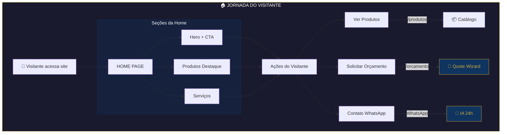

### 1.2 Navegação de Produtos

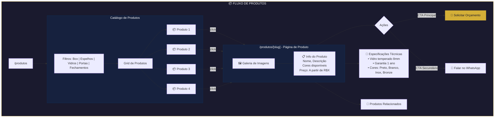

### 1.3 Solicitação de Orçamento (Web) - Quote Wizard

```mermaid
flowchart TD
    subgraph WIZARD["📝 QUOTE WIZARD - 7 ETAPAS"]
        START["/orcamento"] --> STEP1

        subgraph STEP1["ETAPA 1: Categoria"]
            CAT["O que você precisa?"]
            CAT --> BOX["🛁 Box"]
            CAT --> ESP["🪞 Espelho"]
            CAT --> VID["🪟 Vidro"]
            CAT --> POR["🚪 Porta"]
        end

        BOX --> STEP2
        ESP --> STEP2
        VID --> STEP2
        POR --> STEP2

        subgraph STEP2["ETAPA 2: Produto"]
            MODEL["Qual modelo?"]
            MODEL --> M1["○ Elegance - correr"]
            MODEL --> M2["○ Comum - abrir"]
            MODEL --> M3["○ Flex - compacto"]
            COR["Cor da ferragem"]
            COR --> C1["● Preto"]
            COR --> C2["○ Branco"]
            COR --> C3["○ Inox"]
            COR --> C4["○ Bronze"]
        end

        STEP2 --> STEP3

        subgraph STEP3["ETAPA 3: Detalhes"]
            MED["📐 Medidas aproximadas<br/>Largura x Altura"]
            FOTO["📷 Fotos do local - opcional"]
            OBS["📝 Observações"]
            SKIP["☐ Não sei as medidas"]
        end

        STEP3 --> STEP4

        subgraph STEP4["ETAPA 4: Carrinho"]
            REVIEW["Revisar item"]
            REVIEW --> ADD["➕ Adicionar mais itens?"]
            ADD --> |"Sim"| STEP1
            ADD --> |"Não"| NEXT4["Continuar"]
        end

        STEP4 --> STEP5

        subgraph STEP5["ETAPA 5: Dados do Cliente"]
            DADOS["👤 Nome, Email, Telefone, CPF/CNPJ"]
            ENDERECO["📍 CEP → Auto-fill endereço"]
        end

        STEP5 --> STEP6

        subgraph STEP6["ETAPA 6: Resumo Final"]
            RESUMO["📋 Resumo do Orçamento<br/>━━━━━━━━━━━━━━━<br/>Box Elegance - Preto<br/>120cm x 190cm<br/>━━━━━━━━━━━━━━━<br/>💰 R$ 1.800 - R$ 2.200"]
            RESUMO --> BTN1["📅 Agendar Visita Técnica"]
            RESUMO --> BTN2["💬 Falar no WhatsApp"]
        end

        BTN1 --> STEP7

        subgraph STEP7["ETAPA 7: Agendamento"]
            CAL["📅 Calendário - Datas disponíveis"]
            SLOTS["🕐 Horários: 09:00 | 10:00 | 14:00 | 15:00"]
            CAL --> SLOTS
            SLOTS --> CONFIRM["✅ Confirmar Agendamento"]
        end

        CONFIRM --> SUCESSO["✅ SUCESSO!<br/>━━━━━━━━━━━━━━━<br/>📅 17/12/2024 às 14:00<br/>📍 Rua X, 100 - Freguesia<br/>🔗 Portal criado<br/>📧 Senha enviada"]

        SUCESSO --> FIM{Próximo passo}
        FIM --> |"Portal"| PORTAL["/portal"]
        FIM --> |"Home"| HOME["/"]
    end

    style WIZARD fill:#1a1a2e,stroke:#d4af37,color:#fff
    style SUCESSO fill:#0f3460,stroke:#22c55e,color:#22c55e
    style STEP1 fill:#16213e,stroke:#d4af37,color:#fff
    style STEP2 fill:#16213e,stroke:#d4af37,color:#fff
    style STEP3 fill:#16213e,stroke:#d4af37,color:#fff
    style STEP4 fill:#16213e,stroke:#d4af37,color:#fff
    style STEP5 fill:#16213e,stroke:#d4af37,color:#fff
    style STEP6 fill:#16213e,stroke:#d4af37,color:#fff
    style STEP7 fill:#16213e,stroke:#d4af37,color:#fff
```

**Mapeamento Técnico - Fluxo de Orçamento:**

| Etapa        | Componentes                   | API Calls                                   | Stores       |
| ------------ | ----------------------------- | ------------------------------------------- | ------------ |
| 1. Categoria | `StepCategory`                | -                                           | `quoteStore` |
| 2. Produto   | `StepProduct`, `ColorPicker`  | GET /products?category=                     | `quoteStore` |
| 3. Detalhes  | `StepDetails`, `ImageUpload`  | POST /upload                                | `quoteStore` |
| 4. Carrinho  | `StepItemReview`              | -                                           | `quoteStore` |
| 5. Dados     | `StepCustomer`, `AddressForm` | GET /api/cep/:cep                           | `quoteStore` |
| 6. Resumo    | `StepFinalSummary`            | POST /quotes                                | `quoteStore` |
| 7. Agenda    | `StepSchedule`, `TimeSlots`   | GET /appointments/slots, POST /appointments | `quoteStore` |

---

## 2. FLUXOS DE IA - CHAT ASSISTIDO

### 2.1 Fluxo Completo do Chat IA 🆕

**Status**: ✅ Implementado (v1.1.0)
**Tecnologias**: Groq (Llama 3.3-70b) + OpenAI (GPT-4o Vision)

```mermaid
flowchart TD
    subgraph CHATIA["🤖 CHAT ASSISTIDO POR IA - Ana"]
        START2["/orcamento"] --> DUAL{Modo de Orçamento}

        DUAL --> |"Tradicional"| WIZARD2["📝 Quote Wizard<br/>7 Steps"]
        DUAL --> |"💬 Falar com Ana"| MODAL["Modal Chat IA"]

        subgraph MODAL_CONTENT["💬 MODAL CHAT"]
            ANA1["🤖 Ana: Olá! Sou a Ana, assistente<br/>da Versati Glass. Como posso ajudar?"]
            USER1["👤 Você: Preciso de um box de banheiro"]
            ANA1 --> USER1

            USER1 --> |"POST /api/ai/chat"| GROQ["⚡ Groq API<br/>Llama 3.3-70b<br/>~1-2s"]

            GROQ --> ANA2["🤖 Ana: Ótimo! Qual o tamanho?<br/>Ou prefere enviar uma foto?"]

            ANA2 --> USER2["👤 📷 Envia foto do banheiro"]

            USER2 --> |"POST /api/upload"| UPLOAD["☁️ Upload<br/>Cloudflare R2"]
            UPLOAD --> |"imageUrl"| VISION["👁️ OpenAI Vision<br/>GPT-4o<br/>~3-5s"]

            VISION --> ANA3["🤖 Ana: Identifiquei!<br/>✓ Banheiro com banheira<br/>✓ Espaço: 1.20m x 1.90m<br/>✓ Recomendo: Box de Correr<br/>💰 R$ 1.400 - R$ 1.900<br/>Agendar visita técnica?"]

            ANA3 --> USER3["👤 Sim, quero agendar"]

            USER3 --> |"Extração de dados"| EXTRACT["📊 extractedData:<br/>product, measurements"]

            EXTRACT --> ANA4["🤖 Ana: Preciso dos dados:<br/>• Nome completo<br/>• Telefone<br/>• Endereço"]

            ANA4 --> USER4["👤 Fornece dados"]

            USER4 --> |"POST /api/quotes"| SAVE["💾 Salvar no Prisma"]

            SAVE --> ANA5["🤖 Ana: ✅ Orçamento #1234 criado!<br/>📅 19/12/2024 às 14:00<br/>🔗 Portal criado<br/>📧 Senha enviada"]
        end

        subgraph AUTOMACOES["⚡ AUTOMAÇÕES PARALELAS"]
            AUTO1["✅ Salvar AiConversation"]
            AUTO2["✅ Criar Quote"]
            AUTO3["✅ Criar User"]
            AUTO4["✅ Email confirmação"]
            AUTO5["✅ WhatsApp confirmação"]
            AUTO6["✅ Notificar admin"]
        end

        SAVE --> AUTOMACOES
    end

    style CHATIA fill:#1a1a2e,stroke:#d4af37,color:#fff
    style MODAL_CONTENT fill:#16213e,stroke:#9333ea,color:#fff
    style AUTOMACOES fill:#0f3460,stroke:#22c55e,color:#22c55e
    style GROQ fill:#0f3460,stroke:#f97316,color:#f97316
    style VISION fill:#0f3460,stroke:#3b82f6,color:#3b82f6
```

### 2.2 Cenários de Uso do Chat IA

#### Cenário 1: Cliente sem conhecimento técnico

```
Cliente: "Quero trocar o espelho do banheiro"
Ana:     "Claro! Que tamanho é o espelho atual?"
Cliente: "Não sei exato, mas cobre a pia inteira"
Ana:     "Pode tirar uma foto? Assim calculo as medidas"
Cliente: [Envia foto]
Ana:     "Identifiquei: espelho ~80cm x 60cm. Quer lapidado?"
```

**Vantagem**: Cliente não precisa medir nada

#### Cenário 2: Cliente com urgência

```
Cliente: "Quebrou vidro do box, urgente!"
Ana:     "Entendo! Qual o tipo? (correr, abrir, elegance)"
Cliente: "De correr, vidro só de um lado"
Ana:     "Consegue fazer instalação emergência amanhã?"
```

**Vantagem**: Escalonamento rápido para atendimento humano

#### Cenário 3: Cliente comparando produtos

```
Cliente: "Qual diferença box elegance vs comum?"
Ana:     "Box Elegance tem perfil mais fino e ferragem premium.
          Comum: R$ 1.400-1.900
          Elegance: R$ 1.800-2.500

          Para ambiente moderno, recomendo Elegance"
```

**Vantagem**: Consultoria instantânea

### 2.3 Arquitetura Técnica do Chat

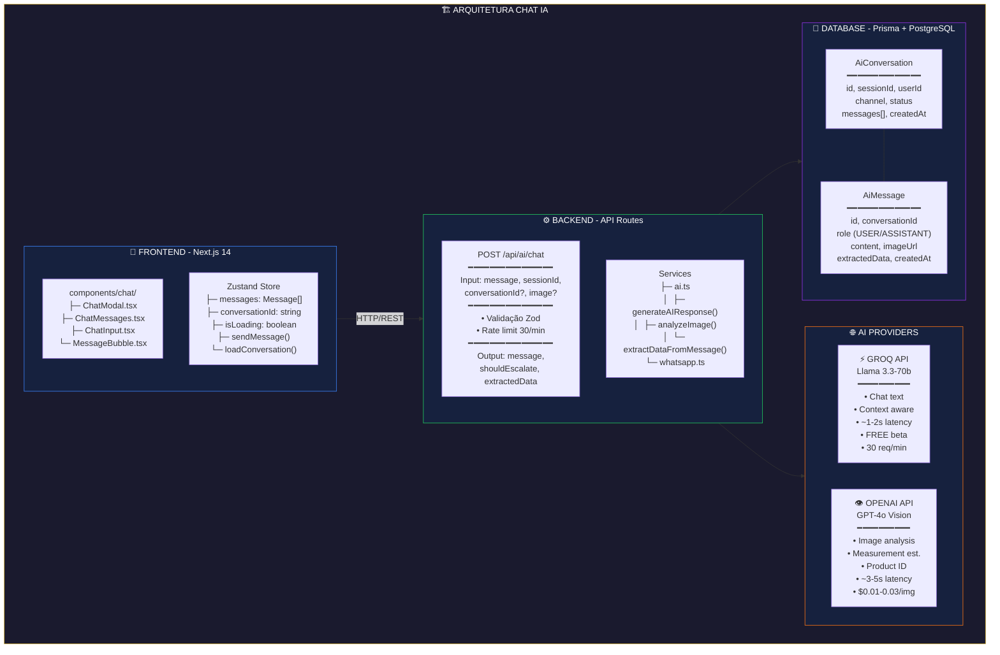

### 2.4 Prompts e Personalidade da Ana

**System Prompt** (src/services/ai.ts):

```typescript
const SYSTEM_PROMPT = `
Você é a Ana, assistente virtual da Versati Glass,
vidraçaria premium do Rio de Janeiro.

PERSONALIDADE:
- Amigável, profissional e prestativa
- Fala português brasileiro natural
- Usa emojis com moderação (1-2 por mensagem)
- Paciente com clientes

PRODUTOS:
1. Box para banheiro (correr, abrir, elegance, flex)
2. Espelhos (comum, LED, bisotê)
3. Vidros temperados (tampos, prateleiras)
4. Portas e janelas

PREÇOS APROXIMADOS:
- Box simples: R$ 1.400 - R$ 1.900
- Box Elegance: R$ 1.800 - R$ 2.500
- Espelho 4mm: R$ 180/m²

FLUXO DE ATENDIMENTO:
1. Identificar necessidade
2. Coletar medidas ou oferecer visita
3. Coletar endereço
4. Gerar orçamento ou agendar visita
5. Sempre oferecer visita técnica gratuita

REGRAS:
- NUNCA invente preços exatos
- SEMPRE ofereça visita técnica
- Se não souber, diga que especialista entrará em contato
- Colete: nome, telefone, endereço, descrição
- Respostas curtas (max 3-4 frases)
`
```

**Vision Prompt** (para análise de imagens):

```typescript
const VISION_PROMPT = `
Analise esta imagem de banheiro/ambiente e identifique:

1. Tipo de produto necessário (box, espelho, vidro, porta)
2. Configuração do espaço (canto, frontal, lateral)
3. Medidas aproximadas (largura x altura em metros)
4. Acabamentos visíveis (ferragens, cores, materiais)
5. Observações importantes (revestimento, obstáculos)

Responda em português BR, formato natural e amigável.
Seja específico mas não técnico demais.
`
```

### 2.5 Estados e Fluxos de Conversa

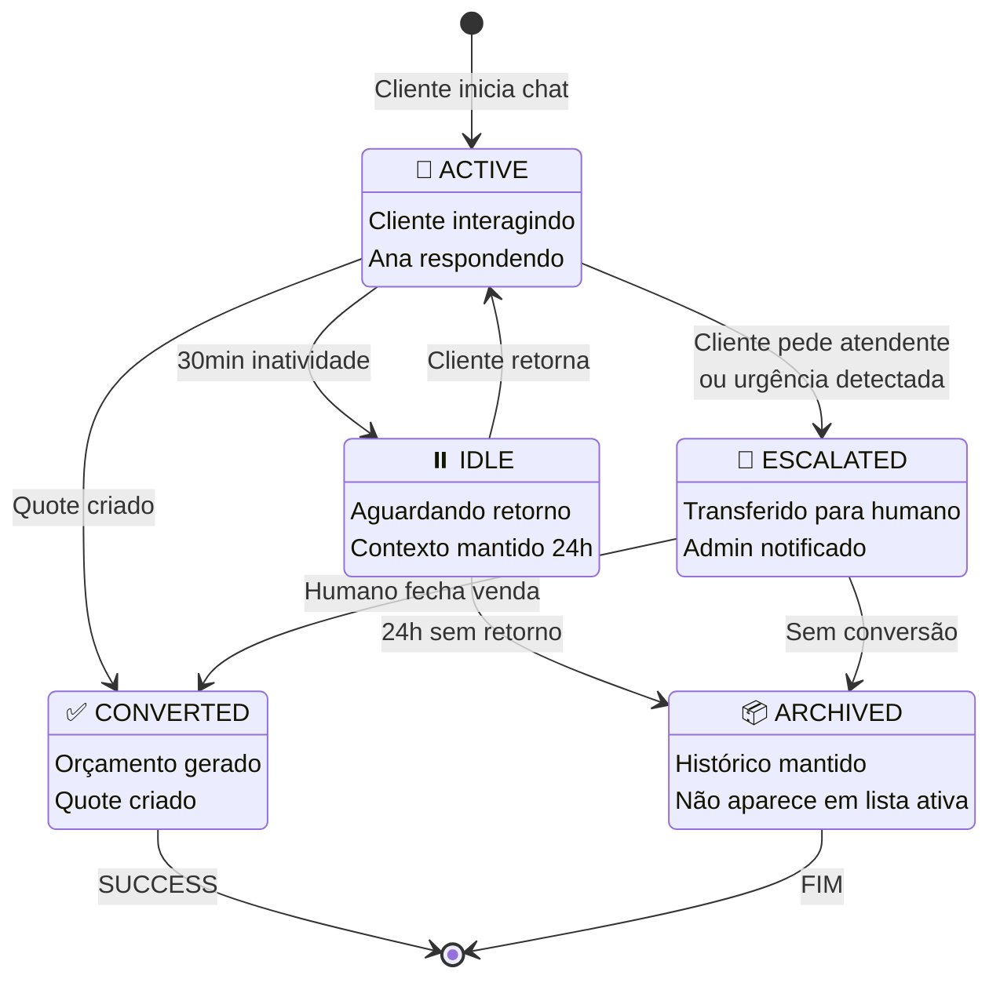

### 2.6 Métricas e Analytics

**Métricas rastreadas**:

| Métrica               | Descrição              | Meta    |
| --------------------- | ---------------------- | ------- |
| **Taxa de Conversão** | Conversas → Orçamentos | > 40%   |
| **Taxa de Escalação** | Conversas → Humano     | < 15%   |
| **Tempo Médio**       | Duração da conversa    | 3-5 min |
| **Satisfação**        | Rating pós-conversa    | > 4.5/5 |
| **Taxa de Abandono**  | Conversas incompletas  | < 20%   |

**Dashboard Admin** (futuro):

- Conversas em tempo real
- Histórico de conversas
- Analytics de performance
- Treinamento da IA (feedback loop)

---

## 3. FLUXOS DO CLIENTE

### 3.1 Autenticação

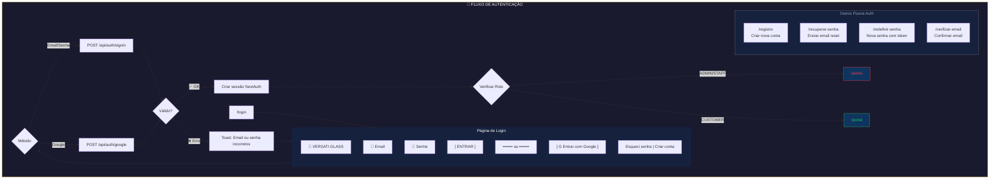

### 3.2 Portal - Dashboard

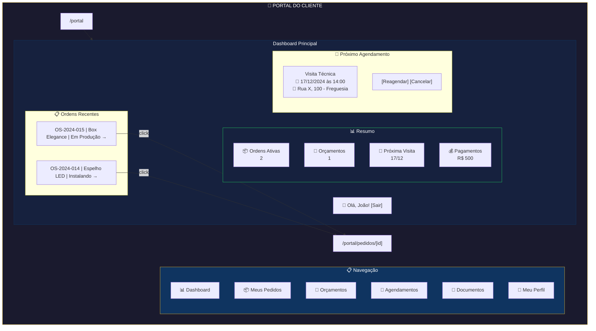

### 3.3 Portal - Detalhe do Pedido

```mermaid
flowchart TD
    subgraph ORDEM["📦 DETALHE DO PEDIDO"]
        ROUTE3["/portal/pedidos/[id]"] --> CONTENT

        subgraph CONTENT["OS-2024-015"]
            BACK["← Voltar para Pedidos"]
            STATUS["Status: 🔵 Em Produção"]

            subgraph TIMELINE["📈 Timeline"]
                T1["✅ 10/12 - Orçamento aprovado"]
                T2["✅ 11/12 - Pagamento confirmado"]
                T3["✅ 12/12 - Entrada em produção"]
                T4["🔵 Em andamento - Produção<br/>Previsão: 16/12"]
                T5["⬜ Pronto para entrega"]
                T6["⬜ Instalação agendada"]
                T7["⬜ Instalação"]
                T8["⬜ Concluído"]
                T1 --> T2 --> T3 --> T4 --> T5 --> T6 --> T7 --> T8
            end

            subgraph ITENS["📋 Itens do Pedido"]
                ITEM1["Box Elegance - Preto<br/>120cm x 190cm<br/>Qtd: 1 | R$ 1.950,00"]
            end

            subgraph DOCS["📄 Documentos"]
                DOC1["📄 Contrato.pdf [Baixar]"]
                DOC2["📄 Garantia.pdf [Baixar]"]
            end

            subgraph PAGAMENTO["💰 Pagamento"]
                PAG1["Total: R$ 1.950,00"]
                PAG2["Pago: R$ 1.950,00 ✅"]
                PAG3["Método: PIX"]
            end
        end
    end

    style ORDEM fill:#1a1a2e,stroke:#d4af37,color:#fff
    style TIMELINE fill:#16213e,stroke:#3b82f6,color:#fff
    style ITENS fill:#16213e,stroke:#22c55e,color:#fff
    style DOCS fill:#16213e,stroke:#f97316,color:#fff
    style PAGAMENTO fill:#16213e,stroke:#d4af37,color:#fff
```

---

## 4. FLUXOS DO WHATSAPP

### 4.1 Fluxo Completo de Orçamento via WhatsApp

```mermaid
flowchart TD
    subgraph WHATSAPP["📱 FLUXO WHATSAPP - ORÇAMENTO"]
        START3["Cliente envia msg<br/>WhatsApp"] --> INICIO

        subgraph INICIO["Estado: inicio"]
            MSG1["👤 Olá / Oi / Bom dia"]
            MSG1 --> MENU["🤖 Menu:<br/>1. Fazer orçamento<br/>2. Acompanhar pedido<br/>3. Falar com atendente"]
        end

        MENU --> |"Opção 1"| CATEGORIA

        subgraph CATEGORIA["Estado: coleta_categoria"]
            CAT_IA["🤖 O que você precisa?<br/>Box, Espelho, Vidro, Porta"]
            CAT_CLI["👤 Box"]
        end

        CATEGORIA --> MODELO

        subgraph MODELO["Estado: coleta_modelo"]
            MOD_IA["🤖 Qual modelo de box?<br/>Elegance, Comum, Flex"]
            MOD_CLI["👤 Elegance"]
        end

        MODELO --> COR

        subgraph COR["Estado: coleta_cor"]
            COR_IA["🤖 Qual cor da ferragem?<br/>Preto, Branco, Inox, Bronze"]
            COR_CLI["👤 Preto"]
        end

        COR --> MEDIDAS

        subgraph MEDIDAS["Estado: coleta_medidas"]
            MED_IA["🤖 Sabe as medidas?<br/>Pode mandar foto também!"]
            MED_CLI["👤 📷 Envia foto"]
            MED_VISION["👁️ Vision: ~120cm x 190cm"]
        end

        MEDIDAS --> CEP

        subgraph CEP["Estado: coleta_cep"]
            CEP_IA["🤖 Qual seu CEP?"]
            CEP_CLI["👤 22745-005"]
            CEP_VALID["✅ Freguesia - atendemos!"]
        end

        CEP --> ORCAMENTO

        subgraph ORCAMENTO["Estado: apresenta_orcamento"]
            ORC_IA["🤖 Seu orçamento:<br/>Box Elegance - Preto<br/>120cm x 190cm<br/>💰 R$ 1.800 - R$ 2.200<br/>Quer agendar visita?"]
            ORC_CLI["👤 Sim"]
        end

        ORCAMENTO --> AGENDA

        subgraph AGENDA["Estado: coleta_agenda"]
            AGE_IA["🤖 Horários disponíveis:<br/>Seg 09:00, Ter 14:00..."]
            AGE_CLI["👤 Terça 14h"]
        end

        AGENDA --> DADOS

        subgraph DADOS["Estado: coleta_dados"]
            DAD_IA["🤖 Confirma nome e endereço?"]
            DAD_CLI["👤 João Silva, Rua X 100"]
            DAD_NLP["📊 Extração NLP"]
        end

        DADOS --> CONFIRMACAO

        subgraph CONFIRMACAO["Estado: confirmacao_final"]
            CONF_IA["🤖 ✅ Tudo certo!<br/>📅 17/12 às 14:00<br/>📍 Rua X, 100<br/>🔗 Portal criado"]
            CONF_SYS["⚙️ Sistema cria:<br/>Quote + Appointment + User"]
        end

    end

    style WHATSAPP fill:#1a1a2e,stroke:#25d366,color:#fff
    style INICIO fill:#16213e,stroke:#25d366,color:#fff
    style CONFIRMACAO fill:#0f3460,stroke:#22c55e,color:#22c55e
```

### 4.2 Fluxo de Consulta de Pedido

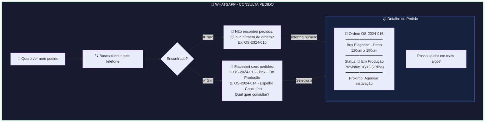

### 4.3 Escalada para Humano

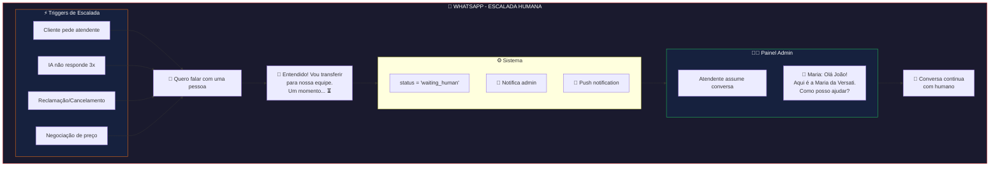

---

## 5. FLUXOS ADMINISTRATIVOS

### 5.1 Gestão de Ordens

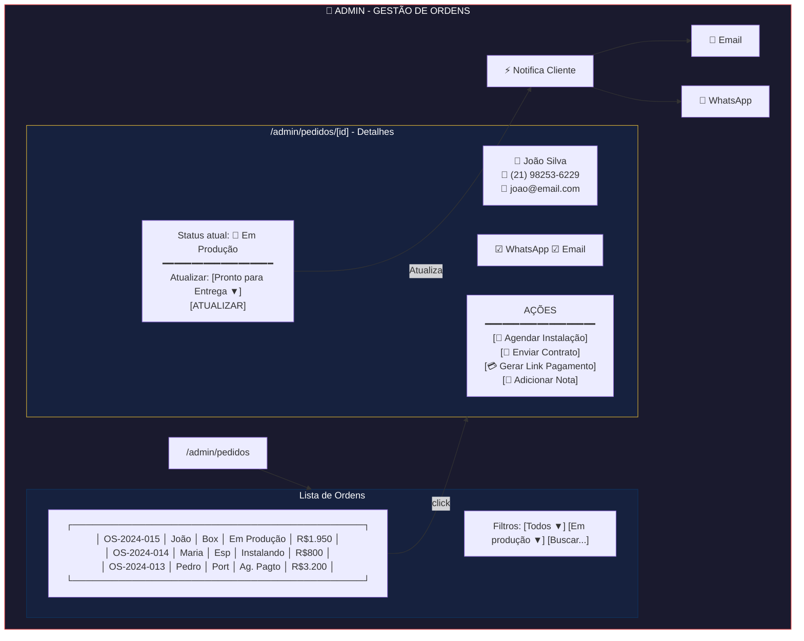

---

## 6. MAPEAMENTO DE PÁGINAS

### 6.1 Páginas Públicas

| Página            | Rota                     | Componentes Principais                                                          |
| ----------------- | ------------------------ | ------------------------------------------------------------------------------- |
| Home              | `/`                      | `Hero`, `ProductHighlights`, `Services`, `Portfolio`, `Testimonials`, `Contact` |
| Produtos          | `/produtos`              | `CategoryFilter`, `ProductGrid`, `ProductCard`                                  |
| Produto Categoria | `/produtos/[cat]`        | `CategoryHeader`, `ProductGrid`                                                 |
| Produto Detalhe   | `/produtos/[cat]/[slug]` | `ProductGallery`, `ProductInfo`, `RelatedProducts`                              |
| Serviços          | `/servicos`              | `ServiceList`, `ServiceCard`                                                    |
| Portfólio         | `/portfolio`             | `PortfolioGrid`, `LightboxGallery`                                              |
| Projeto           | `/portfolio/[slug]`      | `ProjectGallery`, `ProjectDetails`                                              |
| Orçamento         | `/orcamento`             | `QuoteWizard`, `Steps`, `ProductSelector`                                       |
| Contato           | `/contato`               | `ContactForm`, `Map`, `ContactInfo`                                             |
| Sobre             | `/sobre`                 | `AboutContent`, `Team`, `Values`                                                |

### 5.2 Páginas de Autenticação

| Página        | Rota                  | Componentes                |
| ------------- | --------------------- | -------------------------- |
| Login         | `/auth/login`         | `LoginForm`, `SocialLogin` |
| Cadastro      | `/auth/cadastro`      | `RegisterForm`             |
| Esqueci Senha | `/auth/esqueci-senha` | `ForgotPasswordForm`       |
| Resetar Senha | `/auth/resetar-senha` | `ResetPasswordForm`        |

### 5.3 Páginas do Portal (Cliente)

| Página            | Rota                      | Componentes                                         |
| ----------------- | ------------------------- | --------------------------------------------------- |
| Dashboard         | `/portal`                 | `DashboardStats`, `RecentOrders`, `NextAppointment` |
| Ordens            | `/portal/ordens`          | `OrderList`, `OrderFilters`                         |
| Ordem Detalhe     | `/portal/ordens/[id]`     | `OrderTimeline`, `OrderItems`, `OrderDocuments`     |
| Orçamentos        | `/portal/orcamentos`      | `QuoteList`                                         |
| Orçamento Detalhe | `/portal/orcamentos/[id]` | `QuoteDetails`, `QuoteActions`                      |
| Agenda            | `/portal/agenda`          | `AppointmentList`, `Calendar`                       |
| Documentos        | `/portal/documentos`      | `DocumentList`, `DocumentViewer`                    |
| Pagamentos        | `/portal/pagamentos`      | `PaymentHistory`, `PendingPayments`                 |
| Perfil            | `/portal/perfil`          | `ProfileForm`, `AddressManager`                     |

### 5.4 Páginas Admin

| Página          | Rota                   | Componentes                                    |
| --------------- | ---------------------- | ---------------------------------------------- |
| Dashboard       | `/admin`               | `AdminStats`, `RevenueChart`, `RecentActivity` |
| Produtos        | `/admin/produtos`      | `ProductTable`, `ProductForm`                  |
| Serviços        | `/admin/servicos`      | `ServiceTable`, `ServiceForm`                  |
| Orçamentos      | `/admin/orcamentos`    | `QuoteTable`, `QuoteActions`                   |
| Ordens          | `/admin/ordens`        | `OrderTable`, `OrderFilters`                   |
| Ordem Detalhe   | `/admin/ordens/[id]`   | `OrderManagement`, `StatusUpdater`             |
| Clientes        | `/admin/clientes`      | `CustomerTable`, `CustomerSearch`              |
| Cliente Detalhe | `/admin/clientes/[id]` | `CustomerProfile`, `CustomerHistory`           |
| Agenda          | `/admin/agenda`        | `FullCalendar`, `AppointmentModal`             |
| Financeiro      | `/admin/financeiro`    | `FinancialReports`, `PaymentTable`             |
| Portfólio       | `/admin/portfolio`     | `PortfolioManager`, `ImageUploader`            |
| Configurações   | `/admin/config`        | `SettingsForm`, `IntegrationSettings`          |

---

## 7. ESTADOS E TRANSIÇÕES

### 7.1 Estados de Orçamento (Quote)

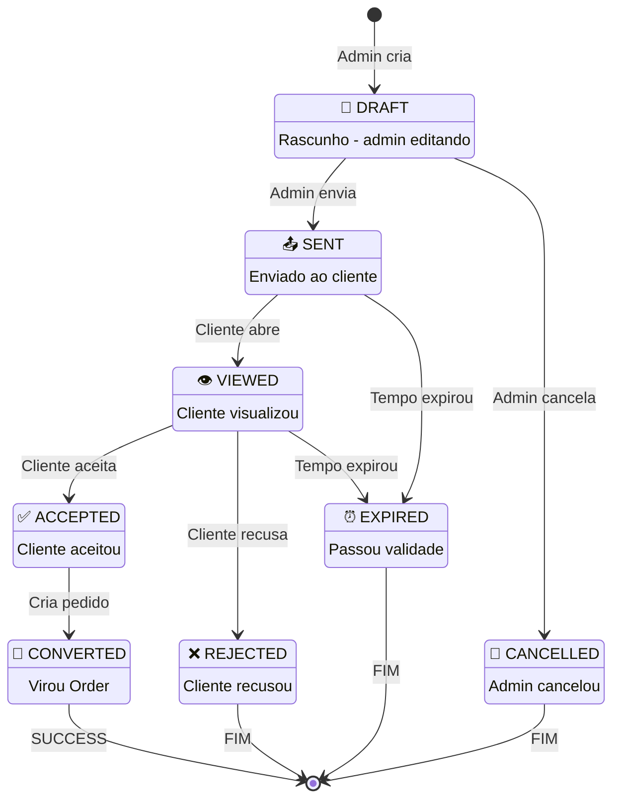

### 7.2 Estados de Ordem (Order)

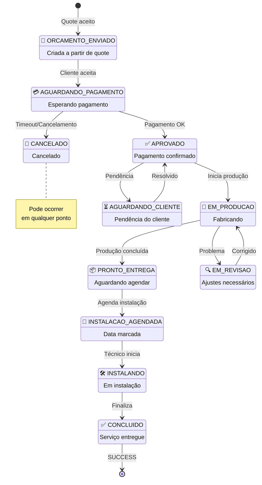

### 7.3 Estados de Agendamento (Appointment)

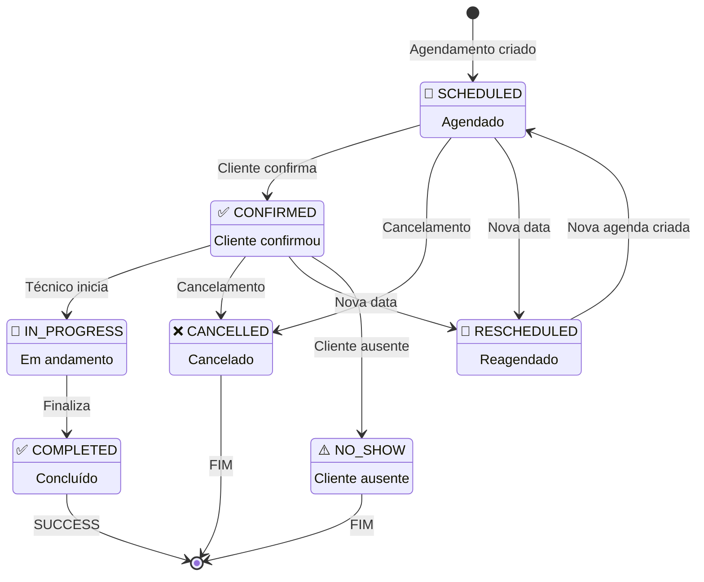

---

## 8. DIAGRAMAS MERMAID CONSOLIDADOS

Esta seção contém um resumo visual de todos os fluxos principais do sistema.

### 8.1 Jornada Completa do Cliente

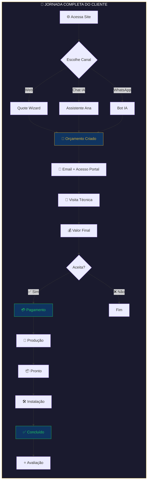

### 8.2 Mapa de Integrações

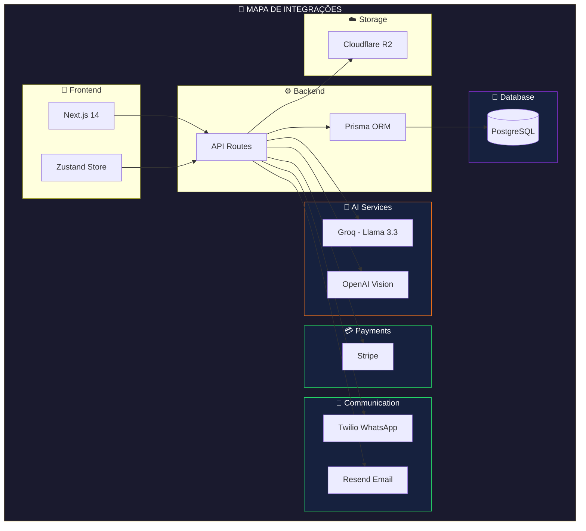

---

_Versati Glass User Flows v2.0 - Dezembro 2024_
_Diagramas convertidos para Mermaid_
