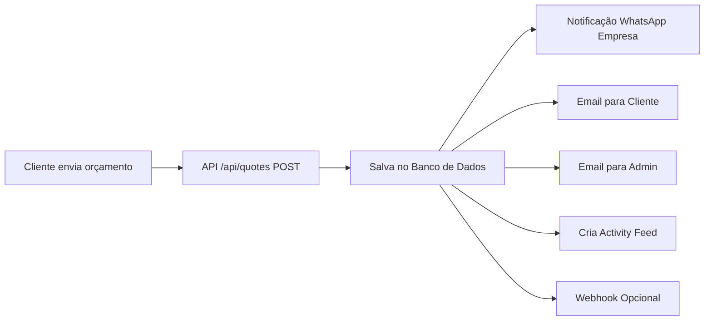
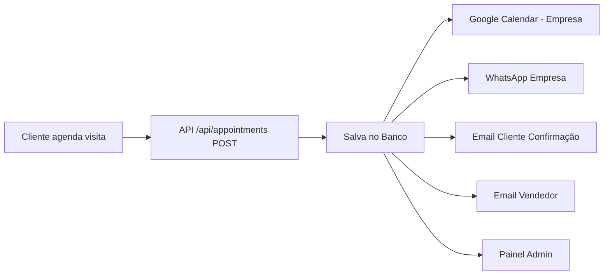

# 📬 Arquitetura de Notificações - Versati Glass

**Data:** 17 Dezembro 2024
**Status:** Documentação Técnica + Plano de Implementação

---

## 🎯 Visão Geral

Este documento define a arquitetura completa de notificações e integrações para o sistema Versati Glass, incluindo WhatsApp, Email, Google Calendar e Painel Admin.

---

## 📊 Fluxo de Notificações por Evento

### 1. **Orçamento Criado (QUOTE_CREATED)**

**Quando:** Cliente finaliza Step 6 (Resumo Final) e clica "Enviar Orçamento"

**Ações Automáticas:**



**Destinatários:**

1. **WhatsApp da Empresa** ✅
   - Número: Configurado em `.env` (WHATSAPP_BUSINESS_NUMBER)
   - Mensagem: "🔔 Novo orçamento #ORC-2024-0042 de João Silva"
   - Link: Para painel admin `/admin/orcamentos/[id]`

2. **Email do Cliente** ✅
   - Template: `quote-received.tsx`
   - Assunto: "Orçamento #ORC-2024-0042 recebido"
   - Conteúdo: Confirmação + resumo + próximos passos

3. **Email do Admin/Vendedor** ✅
   - Template: `new-quote-admin.tsx`
   - Assunto: "[NOVO] Orçamento #ORC-2024-0042"
   - Conteúdo: Dados completos + link direto

4. **Painel Admin** ✅
   - Activity Feed: Novo item "QUOTE_CREATED"
   - Badge de notificação: +1
   - Lista de orçamentos: Novo item no topo

---

### 2. **Agendamento de Visita (APPOINTMENT_SCHEDULED)**

**Quando:** Cliente finaliza Step 7 (Agendamento) e escolhe data/hora

**Ações Automáticas:**



**Destinatários:**

1. **Google Calendar da Empresa** 🎯 (IMPLEMENTAR)
   - Evento criado automaticamente
   - Título: "Visita Técnica - João Silva"
   - Descrição: Link para orçamento + dados do cliente
   - Lembretes: 1 dia antes + 1 hora antes

2. **WhatsApp da Empresa** ✅
   - Mensagem: "📅 Visita agendada para 20/12/2024 às 14:00"
   - Cliente: João Silva
   - Endereço: Rua X, 123

3. **Email do Cliente** ✅
   - Template: `appointment-confirmation.tsx`
   - Assunto: "Visita confirmada para 20/12/2024"
   - Botões: Adicionar ao calendário (iCal)

4. **Painel Admin** ✅
   - Calendário de agendamentos
   - Activity Feed
   - Notificação visual

---

## 🔧 Integrações Técnicas

### **1. WhatsApp Business API**

#### **Opção A: WhatsApp Business API Oficial** (Recomendado para Produção)

```typescript
// Provedor: Twilio WhatsApp Business
// Custo: ~$0.005 por mensagem

interface WhatsAppConfig {
  provider: 'twilio' | 'meta' | 'infobip'
  accountSid: string
  authToken: string
  fromNumber: string // +55 11 9XXXX-XXXX
}

// Funcionalidades:
// ✅ Enviar mensagens (empresa → cliente)
// ✅ Receber mensagens (cliente → empresa)
// ✅ Webhooks para respostas
// ✅ Templates aprovados pelo WhatsApp
// ✅ Rastreamento de entrega
```

**Implementação:**

```typescript
// src/services/whatsapp.ts
import twilio from 'twilio'

export async function sendWhatsAppToCompany(message: string) {
  const client = twilio(
    process.env.TWILIO_ACCOUNT_SID,
    process.env.TWILIO_AUTH_TOKEN
  )

  await client.messages.create({
    from: `whatsapp:${process.env.TWILIO_WHATSAPP_NUMBER}`,
    to: `whatsapp:${process.env.COMPANY_WHATSAPP_NUMBER}`,
    body: message
  })
}

export async function sendWhatsAppToCustomer(
  customerPhone: string,
  template: 'quote_received' | 'appointment_confirmed',
  variables: Record<string, string>
) {
  // Usa templates pré-aprovados
  const client = twilio(...)

  await client.messages.create({
    from: `whatsapp:${process.env.TWILIO_WHATSAPP_NUMBER}`,
    to: `whatsapp:${customerPhone}`,
    contentSid: TEMPLATE_MAP[template],
    contentVariables: JSON.stringify(variables)
  })
}
```

#### **Opção B: WhatsApp Web (Não Recomendado)**

```typescript
// Provedor: whatsapp-web.js (não oficial)
// Problema: Viola ToS do WhatsApp, conta pode ser banida
// ❌ NÃO usar em produção
```

#### **Sincronização de Mensagens: POSSÍVEL?**

**SIM**, mas apenas com WhatsApp Business API oficial:

```typescript
// Webhook recebe mensagens do cliente
export async function POST(request: Request) {
  const { From, Body, MessageSid } = await request.json()

  // Salvar mensagem no banco de dados
  await prisma.whatsAppMessage.create({
    data: {
      from: From,
      body: Body,
      messageId: MessageSid,
      direction: 'INBOUND',
      timestamp: new Date(),
    },
  })

  // Atualizar conversa no admin
  // Notificar via WebSocket
}

// Admin pode ver histórico completo:
// GET /api/admin/whatsapp/conversations
// - Todas as mensagens enviadas pela plataforma
// - Todas as respostas dos clientes
// - Status de entrega (enviado, entregue, lido)
```

**Limitações:**

- ❌ Não mostra mensagens de outros apps (WhatsApp pessoal do vendedor)
- ✅ Mostra apenas mensagens do número Business API
- ✅ Admin pode responder DENTRO da plataforma
- ✅ Histórico completo centralizado

---

### **2. Google Calendar API**

```typescript
// src/services/google-calendar.ts
import { google } from 'googleapis'

interface CalendarConfig {
  clientId: string
  clientSecret: string
  refreshToken: string
  calendarId: string // primary ou ID específico
}

export async function createAppointmentEvent(appointment: {
  customerName: string
  date: Date
  address: string
  quoteId: string
}) {
  const oauth2Client = new google.auth.OAuth2(
    process.env.GOOGLE_CLIENT_ID,
    process.env.GOOGLE_CLIENT_SECRET
  )

  oauth2Client.setCredentials({
    refresh_token: process.env.GOOGLE_REFRESH_TOKEN,
  })

  const calendar = google.calendar({ version: 'v3', auth: oauth2Client })

  const event = await calendar.events.insert({
    calendarId: 'primary',
    requestBody: {
      summary: `Visita Técnica - ${appointment.customerName}`,
      description: `
        Orçamento: #${appointment.quoteId}
        Cliente: ${appointment.customerName}
        Endereço: ${appointment.address}

        Ver detalhes: ${process.env.NEXT_PUBLIC_APP_URL}/admin/agendamentos/${appointment.id}
      `,
      start: {
        dateTime: appointment.date.toISOString(),
        timeZone: 'America/Sao_Paulo',
      },
      end: {
        dateTime: new Date(appointment.date.getTime() + 2 * 60 * 60 * 1000).toISOString(),
        timeZone: 'America/Sao_Paulo',
      },
      reminders: {
        useDefault: false,
        overrides: [
          { method: 'email', minutes: 24 * 60 }, // 1 dia antes
          { method: 'popup', minutes: 60 }, // 1 hora antes
        ],
      },
    },
  })

  return event.data
}
```

**Setup Inicial (One-time):**

1. Criar projeto no Google Cloud Console
2. Ativar Google Calendar API
3. Criar credenciais OAuth 2.0
4. Gerar refresh token (usar script de autenticação)
5. Salvar tokens em `.env`

---

### **3. Sistema de Emails (Resend)**

```typescript
// src/services/email.ts (já implementado)
import { Resend } from 'resend'

const resend = new Resend(process.env.RESEND_API_KEY)

// Templates de Email (React Email)
// src/emails/quote-received.tsx
export async function sendQuoteReceivedEmail(quote: Quote) {
  await resend.emails.send({
    from: 'Versati Glass <orcamentos@versatiglass.com>',
    to: quote.customerEmail,
    subject: `Orçamento ${quote.number} recebido`,
    react: QuoteReceivedEmail({ quote }),
  })
}

// src/emails/appointment-confirmed.tsx
export async function sendAppointmentEmail(appointment: Appointment) {
  const icsFile = generateICS(appointment) // iCalendar format

  await resend.emails.send({
    from: 'Versati Glass <agendamentos@versatiglass.com>',
    to: appointment.customerEmail,
    subject: `Visita confirmada para ${formatDate(appointment.date)}`,
    react: AppointmentConfirmedEmail({ appointment }),
    attachments: [
      {
        filename: 'agendamento.ics',
        content: icsFile,
      },
    ],
  })
}
```

---

## 📱 Arquitetura de Notificações no Admin

### **Painel Admin: Activity Feed + Real-time**

```typescript
// Opção 1: Polling (Simples)
// Admin busca novas notificações a cada 30s
useEffect(() => {
  const interval = setInterval(async () => {
    const response = await fetch('/api/admin/notifications')
    const data = await response.json()
    setNotifications(data)
  }, 30000)

  return () => clearInterval(interval)
}, [])

// Opção 2: WebSockets (Real-time) - Recomendado
// src/lib/websocket.ts
import { Server } from 'socket.io'

export function initWebSocket(server: Server) {
  const io = new Server(server)

  io.on('connection', (socket) => {
    console.log('Admin connected')

    // Quando novo orçamento chega
    socket.on('new-quote', (quote) => {
      io.emit('notification', {
        type: 'QUOTE_CREATED',
        data: quote,
      })
    })
  })
}

// Admin escuta
const socket = io()
socket.on('notification', (notification) => {
  // Atualiza UI
  // Mostra toast
  // Toca som
})
```

---

## 🔄 Fluxo Completo: Orçamento → Agendamento

```typescript
// 1. Cliente finaliza orçamento (Step 6)
export async function POST(request: Request) {
  // Criar orçamento no banco
  const quote = await prisma.quote.create({ ... })

  // ✅ Notificações síncronas (críticas)
  await sendWhatsAppToCompany(`🔔 Novo orçamento ${quote.number}`)

  // ✅ Notificações assíncronas (background job)
  await notificationQueue.add('quote-created', {
    quoteId: quote.id,
    tasks: [
      'send-email-customer',
      'send-email-admin',
      'create-activity-feed',
      'webhook-zapier'
    ]
  })

  return NextResponse.json({ id: quote.id, number: quote.number })
}

// 2. Background job processa notificações
// src/jobs/notifications.ts
export async function processQuoteCreated(quoteId: string) {
  const quote = await prisma.quote.findUnique({ where: { id: quoteId }})

  await Promise.all([
    sendQuoteReceivedEmail(quote),
    sendAdminNotificationEmail(quote),
    createActivityFeed('QUOTE_CREATED', quote),
    triggerZapierWebhook(quote)
  ])
}

// 3. Cliente agenda visita (Step 7)
export async function POST(request: Request) {
  const appointment = await prisma.appointment.create({ ... })

  await Promise.all([
    createGoogleCalendarEvent(appointment),
    sendWhatsAppToCompany(`📅 Visita agendada`),
    sendAppointmentEmail(appointment.customer.email, appointment),
    createActivityFeed('APPOINTMENT_SCHEDULED', appointment)
  ])

  return NextResponse.json({ id: appointment.id })
}
```

---

## 🎯 Resposta às Perguntas

### **1. "Onde o orçamento deve ir?"**

✅ **Admin Panel** - Sempre
✅ **WhatsApp da Empresa** - Notificação instantânea
✅ **Email do Admin** - Para registro
✅ **Email do Cliente** - Confirmação

### **2. "Como sincronizar WhatsApp?"**

**SIM**, é possível, mas APENAS com WhatsApp Business API oficial (Twilio/Meta):

- ✅ Admin vê TODAS as mensagens enviadas pela plataforma
- ✅ Admin vê TODAS as respostas dos clientes
- ✅ Admin pode RESPONDER direto na plataforma
- ❌ Admin NÃO vê mensagens de outros números (WhatsApp pessoal)

**Alternativa:** Link "Abrir no WhatsApp" que abre conversa no WhatsApp Web/App

### **3. "Precisa de backend para sincronizar?"**

**SIM**, precisa de:

- WhatsApp Business API (Twilio/Meta)
- Webhook endpoint para receber mensagens
- Banco de dados para armazenar histórico
- WebSocket (opcional) para real-time no admin

### **4. "Agente pode trabalhar sozinho?"**

**SIM**, agente (Claude) pode:

- Processar orçamentos via API
- Enviar notificações
- Criar eventos no Google Calendar
- Tudo via API calls

**MAS** alguns serviços precisam de configuração manual inicial (OAuth tokens).

### **5. "Como orçamento chega no WhatsApp da empresa?"**

```typescript
// Fluxo automático:
Cliente envia orçamento (Step 6)
  ↓
API /api/quotes POST
  ↓
Salva no banco
  ↓
Chama sendWhatsAppToCompany()
  ↓
Twilio envia mensagem para número da empresa
  ↓
WhatsApp da empresa recebe: "🔔 Novo orçamento #ORC-2024-0042"
```

**Sim, DEVE chegar automaticamente!** É uma notificação push essencial.

---

## 📝 Variáveis de Ambiente Necessárias

```env
# WhatsApp (Twilio)
TWILIO_ACCOUNT_SID=ACxxxxxxxxxxxx
TWILIO_AUTH_TOKEN=xxxxxxxxxxxx
TWILIO_WHATSAPP_NUMBER=+14155238886
COMPANY_WHATSAPP_NUMBER=+5511999999999

# Google Calendar
GOOGLE_CLIENT_ID=xxxxx.apps.googleusercontent.com
GOOGLE_CLIENT_SECRET=xxxxx
GOOGLE_REFRESH_TOKEN=xxxxx
GOOGLE_CALENDAR_ID=primary

# Email (Resend)
RESEND_API_KEY=re_xxxxxxxxxxxx
FROM_EMAIL=orcamentos@versatiglass.com

# Admin
ADMIN_EMAIL=admin@versatiglass.com
```

---

## 🚀 Próximos Passos (Prioridade)

1. **P0 - Corrigir erro atual de JSON** ✅ (vou fazer agora)
2. **P1 - Implementar WhatsApp para empresa** (notificação de orçamento)
3. **P1 - Implementar Google Calendar** (agendamentos automáticos)
4. **P2 - Implementar WhatsApp bidirecional** (sincronização de mensagens)
5. **P2 - Implementar WebSocket** (notificações real-time no admin)

---

**Conclusão:** Sim, faz MUITO sentido integrar tudo! É o fluxo profissional esperado de um sistema B2B. Posso implementar tudo isso com você.
